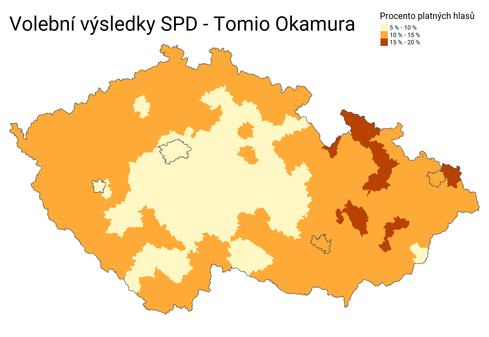
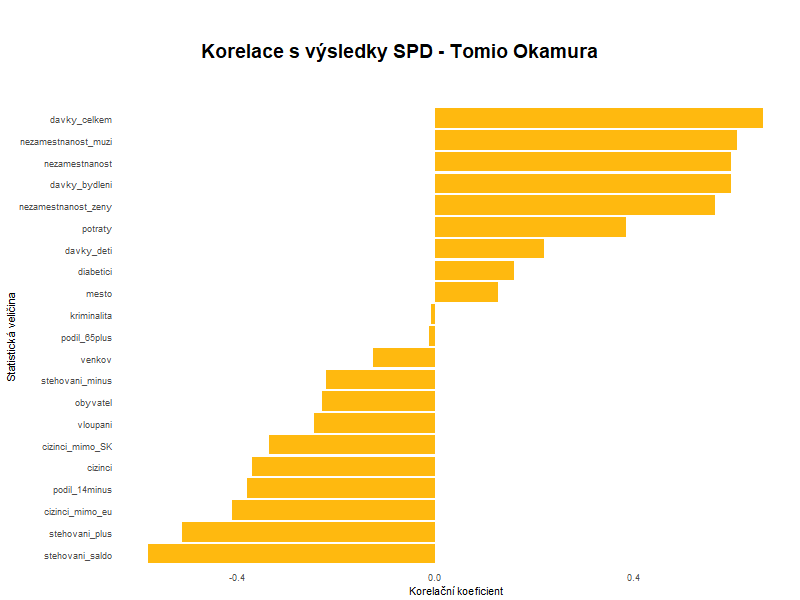

# Tomio
Analýza volebního výsledku SPD - Tomio Okamura

### Cíl snažení:
- ukázat volební podporu populisty a xenofoba Tomio Okamury na mapě
- najít faktory korelované s volebním úspěchem SPD (a pochopit z nich, co na Tomiovi voliči vidí)

### Korelace podpory SPD s následujícími veličinami:  
- počet cizinců, vztažený k počtu obyvatel.  
- počet cizinců, kromě Slováků (kteří u nás nejsou tak úplně cizí), vztažený k počtu obyvatel  
- počet cizinců ze zemí mimo EU (ti "nejcizejší cizinci"), vztažený k počtu obyvatel  
- počet léčených diabetiků (jako míra zdravotního stresu), vztažený k počtu obyvatel  
- počet potratů na 100 narozených dětí (jako míra zdravotního a sociálního stresu)  
- počet vyplacných sociálních dávek, vztažený k počtu obyvatel  
- počet vyplacených příspěvků na bydlení, vztažený k počtu obyvatel  
- počet vyplacených přídavků na děti, vztažený k počtu obyvatel  
- celková hlášená kriminalita, vztažená k počtu obyvatel  
- počet nahlášených vloupání, vztažený k počtu obyvatel  
- podíl dětí (obyvatel věkové skupiny 0 - 14 let) z celkového počtu obyvatel  
- podíl důchodců (obyvatel věkové skupiny 65+) z celkového počtu obyvatel   
- počet obyvatel do okresu přistěhovalých, vztažený k počtu obyvatel  
- počet obyvatel z okresu vystěhovalých, vztažený k počtu obyvatel  
- celkové saldo migrace, vztažené k počtu obyvatel  
- procento obyvatel venkova (obcí do tří tisíc obyvatel)  
- procento obyvatel měst (obcí nad tři tisíce obyvatel)  
- procento celkové nezaměstnanosti  
- procento nezaměstnanosti mužů  
- procento nezaměstnanosti žen  

### Závěr:
- podpora xenofoba má silnou *zápornou* korelaci s přistěhováním a počtem cizinců ze zemí mimo EU v okrese (Tomiovi voliči znají muslima a mešitu leda z televize)  
- silná *pozitivní* korelace podpory strany, která říká NE parazitům, s počtem vyplacených sociálních dávek a nezaměstnaností (zejména nezaměstnaností mužů)
